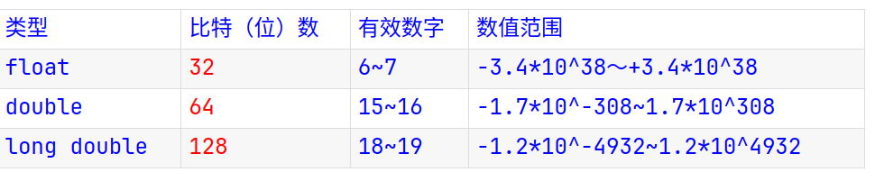
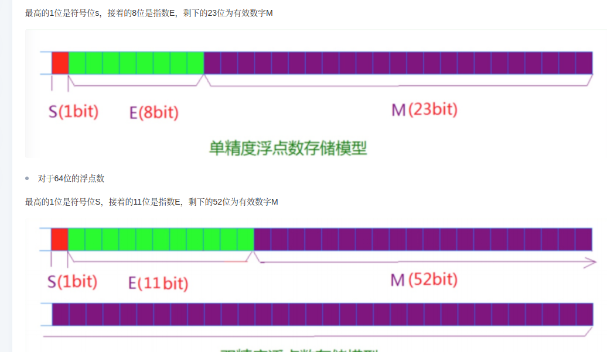

## 计算机中的数的表示

> 对于这里的理解可以去看看算法进阶指南的 0x01章节的`64为整数乘法`的方法二（书的第6页）

###### 整数的表示

[csapp](https://www.bilibili.com/video/BV1ba4y1E7qy/?spm_id_from=333.788&vd_source=49d04672e5251660f83453ba848c5482)

###### 整数的运算

[csapp](https://www.bilibili.com/video/BV13Z4y1V734/?spm_id_from=333.788&vd_source=49d04672e5251660f83453ba848c5482)

c 语言中需要注意的事项

+ `-5 >> 2` 即算术右移是向下取整，但`-5 / 4` 是向零取整

###### 浮点数

[浮点数的表示以及浮点数的舍入](https://www.bilibili.com/video/BV1zK4y1j7Cn/?p=12&spm_id_from=pageDriver)

浮点数舍入的时候是一位一位的舍入，比如：30位舍入到19位的话，其流程是30 -> 29 -> 28 -> 27 -> ... -> 19

**c语言中不同浮点数类型的精度**

**c语言中 `float` 和 `double` 的内存布局**

